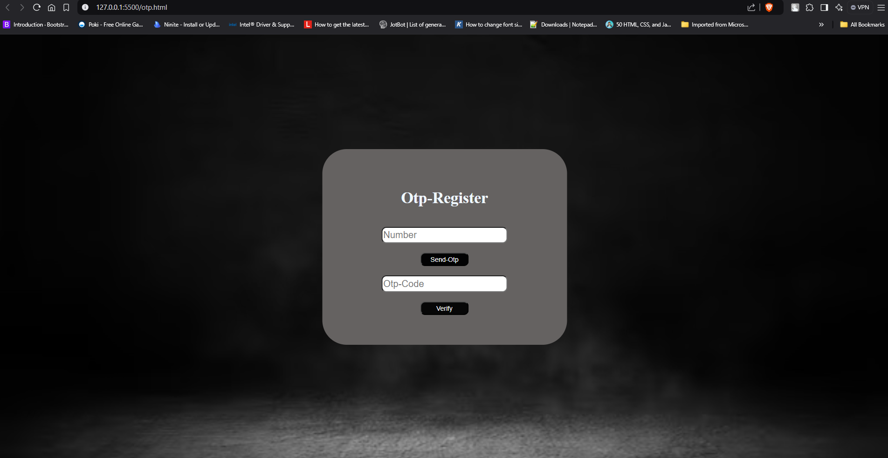

# OTP-Based Signup Form

This project demonstrates an OTP-based signup form using Firebase Authentication for phone number verification. The form is built with HTML, CSS, and JavaScript, and Firebase handles the OTP functionality.

## Features

- Phone number registration with OTP verification.
- Firebase ReCaptcha for bot prevention.
- Firebase authentication integration.

## Preview


*Make sure to replace `preview-image.png` with the actual path to your screenshot or preview image.*

2. **Set Up Firebase**
   - Go to the [Firebase Console](https://console.firebase.google.com/).
   - Create a new project or use an existing one.
## Installation and Setup

1. **Clone the Repository**
   ```bash
   git clone https://github.com/yourusername/otp-signup-form.git
   cd otp-signup-form
   ```

   - Enable Phone Authentication in the Authentication section.
   - Generate Firebase configuration keys.

3. **Replace Firebase Config**
   Update the Firebase configuration object in the `otp.js` file with your Firebase project credentials:
   ```javascript
   const firebaseConfig = {
       apiKey: "YOUR_API_KEY",
       authDomain: "YOUR_AUTH_DOMAIN",
       projectId: "YOUR_PROJECT_ID",
       storageBucket: "YOUR_STORAGE_BUCKET",
       messagingSenderId: "YOUR_MESSAGING_SENDER_ID",
       appId: "YOUR_APP_ID"
   };
   ```

4. **Run the Project**
   Open `index.html` in any modern web browser.

## Usage

1. Enter your phone number in the input field.
2. Complete the ReCaptcha.
3. Click on the **Send OTP** button to receive the OTP.
4. Enter the OTP in the verification field.
5. Click on the **Verify** button to complete the signup process.

## File Structure

```
.
├── index.html      # Main HTML file
├── otp.css         # Stylesheet
├── otp.js          # JavaScript for OTP functionality
├── preview-image.png  # Preview image (add your screenshot here)
```

## Technologies Used

- HTML
- CSS
- JavaScript
- Firebase Authentication

## Screenshots




Feel free to customize this `README.md` file further according to your needs.
